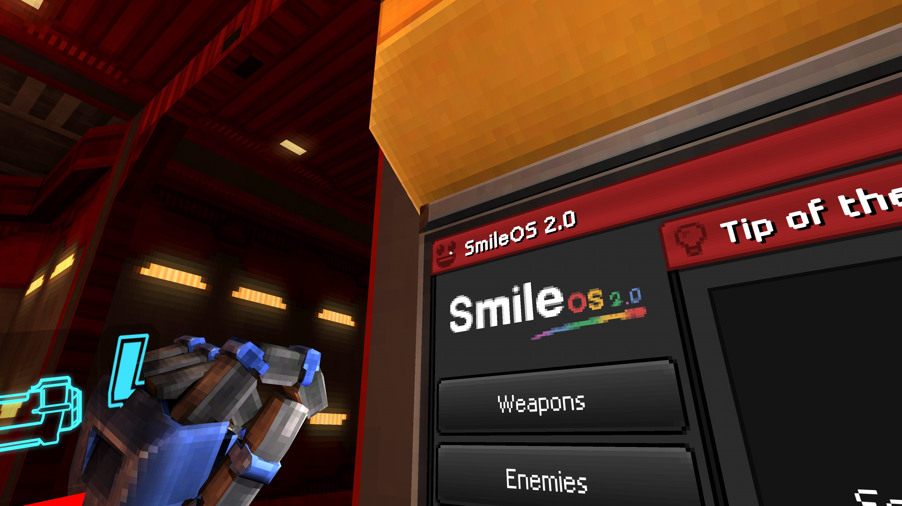
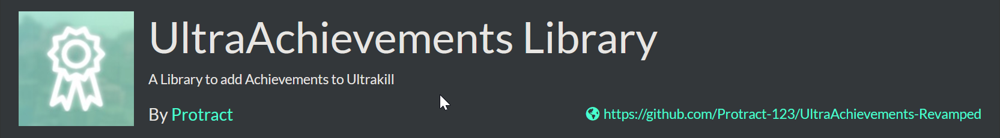
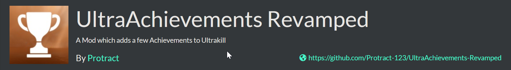

# UltraAchievements-Revamped

**AI Disclaimer:** Claude Code was used to review and identify issues in the codebase. All code was written by me.

UltraAchievements-Revamped is both a mod and library for the hit indie game ULTRAKILL. The **Core** (library) provides utilities for mod developers to create their own achievements. The **Mod** uses the library to add 15 achievements that are interesting compared to basic progression achievements (of which there are none in this mod).

> **Trailer coming Soon™**

## Limitations



- Completed achievements are displayed inside the in-game Shop UI, which can be accessed by clicking on the SmileOS icon in the top left of the Shop UI. This may lead to conflicts with other mods which also use the same icon.

- The settings menu currently doesn't work. It'll probably have settings for the Achievement PopUp in a future version.

## Installation




Both the Mod and Core can be installed the same way. Choose whichever method works best for you:

1. **Thunderstore (Recommended)** - Install via the release published on [Thunderstore](https://thunderstore.io/c/ultrakill/) using a mod manager like [r2ModMan](https://github.com/ebkr/r2modmanPlus). This will automatically detect your ULTRAKILL install and handle all setup for you.

2. **Manual** - Download the latest release from [GitHub Releases](https://github.com/Protract-123/UltraAchievements-Revamped/releases), set up [BepInEx](https://github.com/BepInEx/BepInEx) manually for ULTRAKILL, then move release files into the BepInEx plugins folder.

3. **Build from source** - See [Building from Source](#building-from-source) below.

## Using the Library

UltraAchievementsRevamped.Core is a library that lets mod developers add custom achievements to ULTRAKILL. It handles saving, loading, and in-game display, so you only need to define what an achievement is and when it should be unlocked. To get started, create a new C# project from scratch or use the [ULTRAKILL Template Project](https://github.com/CultOfJakito/UltrakillTemplateProject), which sets up all the necessary boilerplate.

### Creating an Achievement

Achievements can be created in two ways, as a Unity ScriptableObject or entirely in code. This guide covers the code approach, so you don't need Unity set up.

#### Create an AchievementInfo

Call `AchievementInfo.Create<AchievementInfo>()` or `ProgressiveAchievementInfo.Create()` to create a new `AchievementInfo` or `ProgressiveAchievementInfo` instance.

#### Register the achievement

Call `AchievementManager.RegisterAchievementInfos(infos)` to register it. Once registered, the achievement will appear in the Shop UI.

#### Mark it as complete

You need to call `AchievementManager.MarkAchievementComplete(id)` when the triggering event occurs in-game using a `[HarmonyPatch]`. To find the right method to patch, use [UnityExplorer](https://github.com/sinai-dev/UnityExplorer) and [dnSpy](https://github.com/dnSpy/dnSpy) to identify where the event happens in the game's code.

> **Note:** For `ProgressiveAchievementInfo`, completion is handled automatically once `currentProgress` reaches `maxProgress`. Use `AchievementManager.AddProgressToAchievement(id, amount)` to increment progress instead.

### Code Sample

A complete sample `Plugin.cs` file based on the [ULTRAKILL Template Project](https://github.com/CultOfJakito/UltrakillTemplateProject) can be seen below. For more examples, see the `UltraAchievementsRevamped.Mod` folder in this repository.

```cs
using BepInEx;
using BepInEx.Logging;
using HarmonyLib;

namespace TemplateMod;

[BepInPlugin(PluginInfo.Guid, PluginInfo.Name, PluginInfo.Version)]
[HarmonyPatch]
public class Plugin : BaseUnityPlugin
{
    private static class PluginInfo {
        public const string Guid = "yourname.modname";
        public const string Name = "Template";
        public const string Version = "1.0.0";
    }
    
    internal new static ManualLogSource Logger;
    
    private void Awake()
    {
        Logger = base.Logger;
        
        new Harmony(PluginInfo.Guid).PatchAll();
        Logger.LogInfo($"{PluginInfo.Name} v{PluginInfo.Version} has been loaded.");

        achInfo = AchievementInfo.Create<AchievementInfo>(id, sourceMod, icon, displayName, description, isHidden);

        progressiveAchInfo = ProgressiveAchievementInfo.Create(id, sourceMod, icon, displayName, description, isHidden, maxProgress)

        AchievementManager.RegisterAchievementInfos([achInfo, progressiveAchInfo]);
    }

    [HarmonyPatch(typeof(FerrymanFake), "BlowCoin")]
    [HarmonyPostfix]
    private static void FerrymanCoinCheck() =>
        AchievementManager.MarkAchievementComplete("id");

    [HarmonyPatch(typeof(NewMovement), "Respawn")]
    [HarmonyPrefix]
    private static void DeathPatch() =>
        AchievementManager.AddProgressToAchievement("ultraAchievementsRevamped.deathSimulator", 1);
}
```

## Building from Source

Building from source has two parts: the C# solution (the DLL files) and the Unity Addressables (the mod's assets). You can build either or both depending on your needs. Building just the DLLs is much simpler compared to building Addressables which requires more setup.

### Building the C# Solution

**Requirements:** [.NET 10 SDK](https://dotnet.microsoft.com/en-us/download), [Git](https://git-scm.com/downloads)

The following commands clone the repository and build both `Mod` and `Core` DLLs for release:

```shell
git clone https://github.com/Protract-123/UltraAchievements-Revamped.git
cd ./UltraAchievements-Revamped/src
dotnet build -c Release
```

If your ULTRAKILL install is at the default Steam path (`C:\Program Files (x86)\Steam\steamapps\common\ULTRAKILL`), the build will work without any additional changes. If your install is elsewhere, edit `ULTRAKILLPath` in `Directory.Build.props` to point to the correct path before building.

The built DLLs will be located at:

- `./UltraAchievementsRevamped.Core/bin/Release/netstandard2.1/UltraAchievementsRevamped.Core.dll`
- `./UltraAchievementsRevamped.Mod/bin/Release/netstandard2.1/UltraAchievementsRevamped.Mod.dll`

### Building Addressables

**Requirements:** [Unity 2022.3.28f1](https://unity.com/releases/editor/archive), [Vanity Reprised](https://github.com/eternalUnion/VanityReprised), [Git](https://git-scm.com/downloads)

Building the Addressables requires first extracting ULTRAKILL's assets using Vanity Reprised. Follow these steps:

1. Clone this repository:

   ```shell
   git clone https://github.com/Protract-123/UltraAchievements-Revamped.git
   ```

2. Download and unzip the latest release of Vanity Reprised, then run `AssetRipper.GUI.Free.exe`. This launches Vanity Reprised and opens a browser window.

3. In the browser, point Vanity Reprised to your ULTRAKILL folder (the folder named `ULTRAKILL`). Click **Generate RUDE project** to extract the assets. Assets will be extracted to a subdirectory called `Rude` in the selected directory.

4. Copy the following folders from the extracted output into the root of the cloned repository. When prompted, choose to merge or replace existing files:
   - `Libraries`
   - `Packages`
   - `Scripts`
   - `TextMesh Pro`
   - `ULTRAKILL Assets`
   - `ULTRAKILL Others`

5. Open the project in **Unity 2022.3.28f1**. Note: ULTRAKILL officially targets `2022.3.29f1`, but `2022.3.28f1` works without issues. If you encounter problems, try `2022.3.29f1` instead.

6. Build the Addressables via the **Addressable Build Pipeline** menu item. Use **Debug Build** for a faster build which is great for local testing, or **Release Build** for a production build intended for distribution.

## License

UltraAchievements-Revamped is released under the [MIT License](LICENSE).
